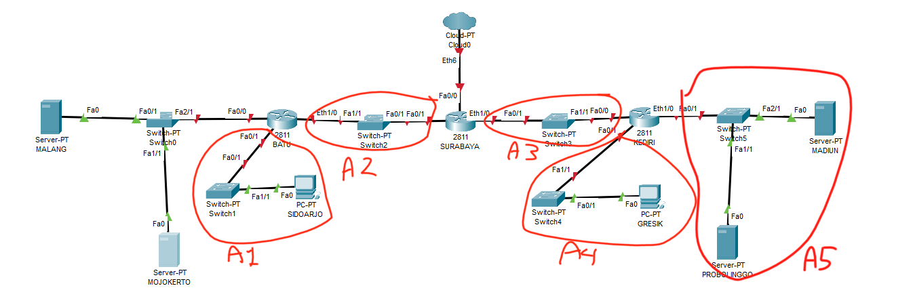
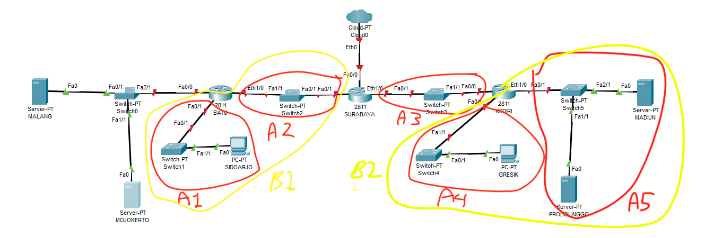
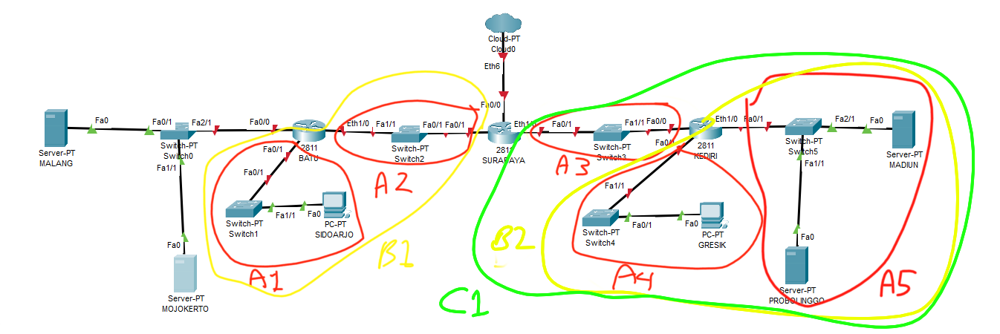
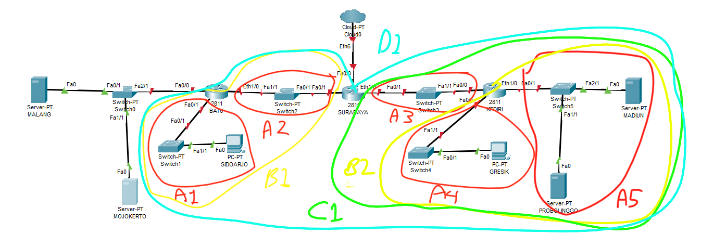
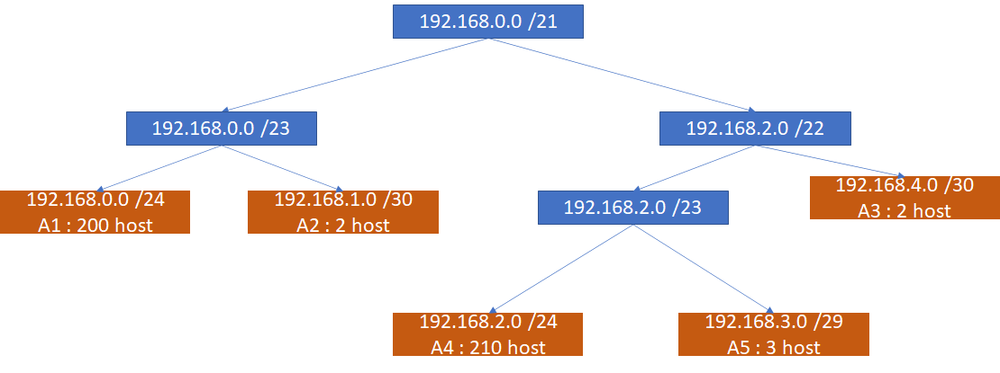

# Jarkom_Modul5_Lapres_D06

> A. Membuat topologi jaringan sebagai berikut :


> SURABAYA diberikan IP TUNTAP<br>
MALANG merupakan DNS Server diberikan IP DMZ<br>
MOJOKERTO merupakan DHCP Server diberikan IP DMZ<br>
MADIUN dan PROBOLINGGO merupakan WEB Server<br>
Setiap Server diberikan memory sebesar 128M<br>
Client dan Router diberikan memori sebesar 96M<br>
Jumlah host pada subnet SIDOARJO 200 Host<br>
Jumlah host pada subnet GRESIK 210 Host<br>


- Dibuatkan file `topologi.sh`, sebagai berikut:

```
    # Switch
    uml_switch -unix switch1 > /dev/null < /dev/null &
    uml_switch -unix switch2 > /dev/null < /dev/null &
    uml_switch -unix switch3 > /dev/null < /dev/null &
    uml_switch -unix switch4 > /dev/null < /dev/null &
    uml_switch -unix switch5 > /dev/null < /dev/null &
    uml_switch -unix switch0 > /dev/null < /dev/null &


    # Router
    xterm -T SURABAYA -e linux ubd0=SURABAYA,jarkom umid=SURABAYA eth0=tuntap,,,10.151.78.29 eth1=daemon,,,switch2 eth2=daemon,,,switch3 mem=96M &
    xterm -T BATU -e linux ubd0=BATU,jarkom umid=BATU eth0=daemon,,,switch2 eth1=daemon,,,switch0 eth2=daemon,,,switch1 mem=96M &
    xterm -T KEDIRI -e linux ubd0=KEDIRI,jarkom umid=KEDIRI eth0=daemon,,,switch3 eth1=daemon,,,switch4 eth2=daemon,,,switch5 mem=96M &
    # Server
    xterm -T MALANG -e linux ubd0=MALANG,jarkom umid=MALANG eth0=daemon,,,switch0 mem=128M &
    xterm -T MOJOKERTO -e linux ubd0=MOJOKERTO,jarkom umid=MOJOKERTO eth0=daemon,,,switch0 mem=128M &
    xterm -T PROBOLINGGO -e linux ubd0=PROBOLINGGO,jarkom umid=PROBOLINGGO eth0=daemon,,,switch5 mem=128M &
    xterm -T MADIUN -e linux ubd0=MADIUN,jarkom umid=MADIUN eth0=daemon,,,switch5 mem=128M &

    # Klien
    xterm -T GRESIK -e linux ubd0=GRESIK,jarkom umid=GRESIK eth0=daemon,,,switch4 mem=96M &
    xterm -T SIDOARJO -e linux ubd0=SIDOARJO,jarkom umid=SIDOARJO eth0=daemon,,,switch1 mem=96M &
```
  
  - Disetting network interface tiap UML pada file `/etc/network/interfaces`, sebagai berikut:
```
# Surabaya
auto eth0
iface eth0 inet static
address 10.151.78.30
netmask 255.255.255.252
gateway 10.151.78.29

auto eth1
iface eth1 inet static
address 192.168.1.1
netmask 255.255.255.252

auto eth2
iface eth2 inet static
address 192.168.4.1
netmask 255.255.255.252


# Batu
auto eth0
iface eth0 inet static
address 192.168.1.2
netmask 255.255.255.252
gateway 192.168.1.1

auto eth1
iface eth1 inet static
address 10.151.79.57
netmask 255.255.255.248

auto eth2
iface eth2 inet static
address 192.168.0.1
netmask 255.255.255.0


# Kediri
auto eth0
iface eth0 inet static
address 192.168.4.2
netmask 255.255.255.252
gateway 192.168.4.1

auto eth1
iface eth1 inet static
address 192.168.2.1
netmask 255.255.255.0

auto eth2
iface eth2 inet static
address 192.168.3.1
netmask 255.255.255.248


# Malang
auto eth0
iface eth0 inet static
address 10.151.79.58
netmask 255.255.255.248
gateway 10.151.79.57


# Mojokerto
auto eth0
iface eth0 inet static
address 10.151.79.59
netmask 255.255.255.248
gateway 10.151.79.57


# Probolinggo
auto eth0
iface eth0 inet static
address 192.168.3.2
netmask 255.255.255.248
gateway 192.168.3.1


# Madiun
auto eth0
iface eth0 inet static
address 192.168.3.3
netmask 255.255.255.248
gateway 192.168.3.1


# Sidoarjo
auto eth0
iface eth0 inet static
address 192.168.0.2
netmask 255.255.255.0
gateway 192.168.0.1


# Gresik
auto eth0
iface eth0 inet static
address 192.168.2.2
netmask 255.255.255.0
gateway 192.168.2.1
```
  
<br>

> B. Melakukan *subnetting* dengan menggunakan teknik **CIDR**, sebagai berikut :

   

   

   

   

   

<br>

> C. Melakukan *Routing* agar semua perangkat dapat terhubung, sebagai berikut :

```
# Surabaya
route add -net 192.168.0.0 netmask 255.255.255.0 gw 192.168.1.2
route add -net 192.168.2.0 netmask 255.255.254.0 gw 192.168.4.2
route add -net 10.151.79.56 netmask 255.255.255.248 gw 192.168.1.2
```

<br>

> D. Memberikan ip pada subnet **SIDOARJO** dan **GRESIK** secara dinamis menggunakan bantuan **DHCP SERVER** dan **DHCP Relay** :
  - Diinstallkan **DHCP Server** pada UML **MOJOKERTO** dan ditambahkan juga subnet berikut pada file `/etc/dhcp/dhcpd.conf`:
```
subnet 192.168.0.0 netmask 255.255.255.0 {
    range 192.168.0.2 192.168.0.222;
    option routers 192.168.0.1;
    option domain-name-servers 202.46.129.2;
    option broadcast-address 192.168.0.255;
    option domain-name-servers 10.151.79.58;
}
subnet 192.168.2.0 netmask 255.255.255.0 {
    range 192.168.2.2 192.168.2.222;
    option routers 192.168.2.1;
    option domain-name-servers 202.46.129.2;
    option broadcast-address 192.168.2.255;
    option domain-name-servers 10.151.79.58;
}
subnet 10.151.79.56 netmask 255.255.255.248 {
    option routers 10.151.79.57;
    option broadcast-address 10.151.79.63;
    option domain-name-servers 10.151.79.58;
}
subnet 192.168.1.0 netmask 255.255.255.252 {
    option routers 192.168.1.1;
    option broadcast-address 192.168.1.3;
    option domain-name-servers 10.151.79.58;
}
subnet 192.168.4.0 netmask 255.255.255.252 {
    option routers 192.168.4.1;
    option broadcast-address 192.168.4.3;
    option domain-name-servers 10.151.79.58;
}
```

  - Diinstallkan **DHCP Relay** pada UML **BATU**, **SURABAYA**, dan **KEDIRI**, dengan masing-masing setting sebagai berikut:
  ```
  # Pada UML Batu
  SERVERS    = "10.151.79.59"
  INTERFACES = "eth0 eth1 eth2"

  # Pada UML Surabaya
  SERVERS    = "10.151.79.59"
  INTERFACES = "eth1 eth2"

  # Pada UML Kediri
  SERVERS    = "10.151.79.59"
  INTERFACES = "eth0 eth1"
  ```
  
  - pada UML **SIDOARJO** dan **GRESIK**, diganti setting network interface pada file `/etc/network/interfaces` pada eth 0-nya,
  ```
# Sidoarjo
auto eth0
iface eth0 inet dhcp

# Gresik
auto eth0
iface eth0 inet dhcp
  ```
  
<br>

> 1. Agar topologi yang kalian buat dapat mengakses keluar, kalian diminta untuk mengkonfigurasi
SURABAYA menggunakan iptables, namun Bibah tidak ingin kalian menggunakan
MASQUERADE.

UML **SURABAYA**

```
iptables -t nat -A POSTROUTING -o eth0 -j SNAT -s 192.168.0.0/16 --to-source 10.151.78.30
```
<br>

```
> -t menentukan tabel yang akan digunakan.
> -A append rules ke chain terkait.
> -o nama interface yang digunakan untuk mengirim paket.
> -j menentukan target dari rule, dan apa yang dilakukan jika paket sesuai.
> -s source.
> --to-source SNAT type option menentukan satu alamat IP sumber baru.
```

<br>

> 2. Kalian diminta untuk mendrop semua akses SSH dari luar Topologi (UML) Kalian pada server
yang memiliki ip DMZ (DHCP dan DNS SERVER) pada SURABAYA demi menjaga keamanan.

UML **SURABAYA**

```
iptables -N VAR
iptables -A VAR -j LOG --log-prefix '2--DROPPED PACKET FROM SSH =>' --log-level 6
iptables -A VAR -j DROP

iptables -A FORWARD -i eth0 -p tcp -d 10.151.79.56/29 --dport 22 -j VAR
```

<br>

```
> -N membuat user defined chain baru.
> --log-prefix menetukan prefix pesan dari log.
> --log-level Level of logging.
> -i nama interface yang digunakan untuk menerima paket.
> -p menentukan protokol yang ingin dicek.
> -d destinasi.
> --dport tcp ekstension port tujuan/desitinasi.
```

<br>

> 3. Karena tim kalian maksimal terdiri dari 3 orang, Bibah meminta kalian untuk membatasi DHCP
dan DNS server hanya boleh menerima maksimal 3 koneksi ICMP secara bersamaan yang berasal dari
mana saja menggunakan iptables pada masing masing server, selebihnya akan di DROP.

UML **MALANG**

```
iptables -N VAR3
iptables -A VAR3 -j LOG --log-prefix '3--DROPPED INCOMING ICMP =>' --log-level 6

iptables -A VAR3 -j DROP

iptables -A INPUT -p icmp -m connlimit --connlimit-above 3 --connlimit-mask 0 -j VAR3
```

UML **MOJOKERTO**

```
iptables -N VAR3
iptables -A VAR3 -j LOG --log-prefix '3--DROPPED INCOMING ICMP =>' --log-level 6

iptables -A VAR3 -j DROP

iptables -A INPUT -p icmp -m connlimit --connlimit-above 3 --connlimit-mask 0 -j VAR3
```

<br>

```
> -m match,menentukan modul ekstensi tertentu untuk digunakan pada match.
> connlimit modul yang mengizinkan membatasi jumlah koneksi TCP parallel menuju server per client IP address.
> --connlimit-above match jika jumlah koneksi TCP diatas n.
> --connlimit-mask group hosts using mask.
```

<br>

> kemudian kalian diminta untuk membatasi akses ke MALANG yang berasal dari SUBNET
SIDOARJO dan SUBNET GRESIK dengan peraturan sebagai berikut:

> 4. Akses dari subnet SIDOARJO hanya diperbolehkan pada pukul 07.00 - 17.00 pada hari Senin sampai Jumat. Selain itu paket akan di REJECT.

UML **MALANG**

```
iptables -N VAR4
iptables -A VAR4 -j LOG --log-prefix '4--DROPPED PACKET =>' --log-level 6

iptables -A VAR4 -j REJECT

iptables -A INPUT -s 192.168.0.0/24 -m time --timestart 07:00 --timestop 17:00 --weekdays Mon,Tue,Wed,Thu,Fri -j ACCEPT

iptables -A INPUT -s 192.168.0.0/24 -j VAR4

```

<br>

```
> time modul match yang mencocokan waktu kedatangan paket dengan range tertentu.
> --timestart match jika setelah/melebihi value.
> --timestop match jika sebelum/kurang dari value.
> --weekdays Only match on the given weekdays.
```

<br>

> 5. Akses dari subnet GRESIK hanya diperbolehkan pada pukul 17.00 hingga pukul 07.00 setiap
harinya. Selain itu paket akan di REJECT.

UML **MALANG**

```
iptables -N VAR5
iptables -A VAR5 -j LOG --log-prefix '5--DROPPED PACKET =>' --log-level 6
iptables -A VAR5 -j REJECT

iptables -A INPUT -s 192.168.2.0/24 -m time --timestart 07:00 --timestop 17:00 -j VAR5

```
<br>

> 6. Bibah ingin SURABAYA disetting sehingga setiap
request dari client yang mengakses DNS Server akan didistribusikan secara bergantian pada
PROBOLINGGO port 80 dan MADIUN port 80.

UML **SURABAYA**

```
iptables -t nat -A PREROUTING -p tcp -d 10.151.79.58 -m statistic --mode nth --every 2 --packet 0 -j DNAT --to-destination 192.168.3.2:80
iptables -t nat -A PREROUTING -p tcp -d 10.151.79.58 -j DNAT --to-destination 192.168.3.3:80
```
<br>

```
> statistic modul match yang mencocokan dengan suatu statistik tertentu.
> --mode menentukan mode matching rule, opsi random dan nth.
> --every match one packet setiap nth packet.
> --packet menentukan conter awal untuk mode nth.
> --to-destination DNAT type option menentukan satu alamat IP tujuan baru.

```

<br>

> 7. Bibah ingin agar semua paket didrop oleh firewall (dalam topologi) tercatat dalam log pada setiap UML yang memiliki aturan drop.

Logging digabung dalam jawaban setiap soal

```
iptables -N SOMEVAR
iptables -A SOMEVAR -j LOG --log-prefix 'MESSEGE DROPPED PACKET =>' --log-level 6
iptables -A SOMEVAR -j DROP
```
<br>


> **Referensi** <br>
> http://ipset.netfilter.org/iptables-extensions.man.html<br>
> https://ipset.netfilter.org/iptables.man.html<br>
> https://linux.die.net/man/8/iptables<br>


